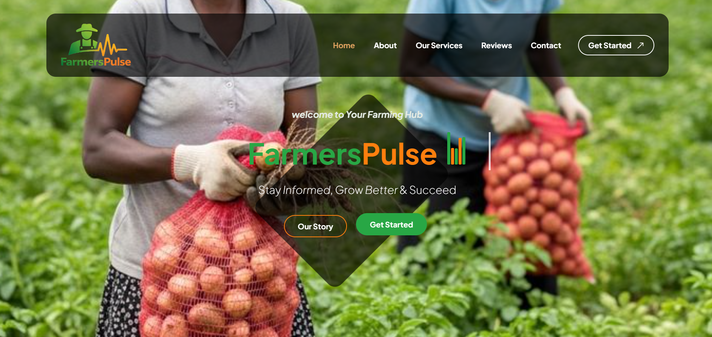

# FarmersPulse — Complete Setup & AI Integration Guide




## Quick Start

```bash
pip install flask werkzeug
python app.py
```

Open http://127.0.0.1:5000

---

## Default Login

| Role  | Username | Password  |
|-------|----------|-----------|
| Admin | `admin`  | `admin123`|

Farmers register themselves at `/login`.

---

## Project Structure

```
fp_v3/
├── app.py                          ← All routes, DB, API endpoints
├── requirements.txt
├── database/
│   └── farmerspulse.db             ← Auto-created on first run (SQLite)
├── static/
│   ├── css/
│   │   ├── main.css                ← Farmer dashboard styles (Times New Roman)
│   │   ├── auth.css                ← Login/register page
│   │   └── admin.css               ← Admin panel styles
│   ├── js/main.js
│   └── uploads/                    ← Profile photos & uploaded post images
└── templates/
    ├── index.html                  ← Your original landing page
    ├── login.html                  ← Sign in / Sign up
    ├── dashboard.html              ← Farmer feed (AI-personalized or chronological)
    ├── post_detail.html            ← Full post + comments
    ├── profile.html                ← Farmer profile (view-only, colourful)
    ├── edit_profile.html           ← Settings
    ├── saved_posts.html
    ├── about.html                  ← About Us page
    ├── feedback.html               ← Feedback submission form
    ├── admin_dashboard.html
    ├── admin_users.html            ← Full user control (ban, edit, delete)
    ├── admin_posts.html
    ├── admin_post_form.html
    ├── admin_pending.html          ← AI post review queue
    ├── admin_reports.html          ← Analytics + CSV/JSON/HTML export
    ├── admin_account.html          ← Admin profile + add new admins
    ├── admin_edit_user.html
    └── admin_feedback.html         ← Farmer feedback inbox
```

---

## AI Model Integration — Full Guide

FarmersPulse exposes a complete API that lets your trained AI model:
1. **Push posts** into the platform (content delivery)
2. **Read all farmer profiles** (to build personalization)
3. **Get all published posts** with engagement data (to rank them)
4. **Push a ranked feed** back for each farmer (personalization)

### API Key

All AI endpoints require this header:
```
X-API-Key: fp-ai-secret-2025
```

Change this in `app.py`:
```python
AI_API_KEY = os.environ.get("FARMERSPULSE_AI_KEY", "fp-ai-secret-2025")
```
Or set the environment variable before running:
```bash
export FARMERSPULSE_AI_KEY=your-strong-secret-key
python app.py
```

---

### Endpoint 1 — Push a New Post (Content Delivery)

```
POST /api/ai/post
```

Your AI generates a post and sends it here. It lands in the **Admin AI Queue** for review before going live.

**Request body (JSON):**
```json
{
  "title": "Maize Advisory: Apply Nitrogen at Knee Height",
  "short_text": "Farmers in Narok should apply CAN fertilizer at 50kg/acre now.",
  "full_text": "Full expanded article text shown when user clicks 'Read more'...",
  "image_url": "https://your-image-host.com/image.jpg",
  "category": "advisory",
  "tags": "maize,fertilizer,narok",
  "target_crops": "Maize",
  "target_counties": "Narok,Nakuru"
}
```

**Required:** `title`, `short_text`
**Optional:** everything else
**Response:** `{"success": true, "post_id": 12, "status": "pending_review"}`

---

### Endpoint 2 — Get All Farmer Profiles (for Batch Personalization)

```
GET /api/ai/bulk-profiles
```

Returns every active, non-banned farmer's profile so your model can run recommendations.

**Response:**
```json
{
  "total": 142,
  "users": [
    {
      "id": 3,
      "username": "kimani_narok",
      "county": "Narok",
      "crop_types": ["Maize", "Wheat"],
      "farm_size": "5-10 acres",
      "last_active": "2026-03-14"
    }
  ]
}
```

---

### Endpoint 3 — Get One Farmer's Full Profile + Interaction History

```
GET /api/ai/user-profile/<user_id>
```

Returns deep profile including what posts the user has liked, saved, and commented on — essential for collaborative filtering.

**Response:**
```json
{
  "user_id": 3,
  "county": "Narok",
  "crop_types": ["Maize"],
  "farm_size": "5-10 acres",
  "interaction_history": {
    "liked_posts": [
      {"id": 4, "category": "advisory", "tags": "maize,fertilizer", "crops": "Maize", "counties": "Narok"}
    ],
    "saved_posts": [...],
    "commented_on": [...]
  }
}
```

---

### Endpoint 4 — Get All Published Posts (for Ranking)

```
GET /api/ai/all-posts?page=1&limit=100
```

Returns all published posts with engagement metrics so your model can score them.

**Response:**
```json
{
  "total": 47,
  "posts": [
    {
      "id": 4,
      "title": "...",
      "category": "advisory",
      "tags": ["maize", "fertilizer"],
      "target_crops": ["Maize"],
      "target_counties": ["Narok"],
      "engagement": {"likes": 23, "comments": 5}
    }
  ]
}
```

---

### Endpoint 5 — Push Ranked Feed for a User (Personalization)

```
POST /api/ai/personalized-feed
```

After your model has ranked posts for a user, send the ordered list here. The farmer's dashboard will serve posts in exactly this order the next time they log in.

**Request body:**
```json
{
  "user_id": 3,
  "post_ids": [4, 7, 1, 12, 3],
  "model_version": "v1.2",
  "request_context": {
    "county": "Narok",
    "crops": ["Maize"]
  }
}
```

**Response:** `{"success": true, "user_id": 3, "posts_ranked": 5}`

> **Fallback:** If no AI ranking exists for a user, FarmersPulse falls back to chronological order automatically.

---

## Full Personalization Workflow (Google Colab)

Here is the complete Python pattern to copy into your Colab notebook:

```python
import requests

BASE_URL = "http://your-server-address:5000"   # Change to your deployed URL
API_KEY  = "fp-ai-secret-2025"                 # Change to your secret key
HEADERS  = {"X-API-Key": API_KEY, "Content-Type": "application/json"}


# ── STEP 1: Get all farmer profiles ──────────────────────────────────────────
def get_all_profiles():
    r = requests.get(f"{BASE_URL}/api/ai/bulk-profiles", headers=HEADERS)
    return r.json()["users"]

# ── STEP 2: Get all posts with engagement ────────────────────────────────────
def get_all_posts():
    all_posts = []
    page = 1
    while True:
        r = requests.get(f"{BASE_URL}/api/ai/all-posts?page={page}&limit=100", headers=HEADERS)
        data = r.json()
        all_posts.extend(data["posts"])
        if len(all_posts) >= data["total"]:
            break
        page += 1
    return all_posts

# ── STEP 3: Get deep profile for one user ────────────────────────────────────
def get_user_profile(user_id):
    r = requests.get(f"{BASE_URL}/api/ai/user-profile/{user_id}", headers=HEADERS)
    return r.json()

# ── STEP 4: Your ranking function (replace with your trained model) ───────────
def rank_posts_for_user(user_profile, all_posts):
    """
    This is where YOUR trained model runs.
    Use user_profile["county"], user_profile["crop_types"],
    user_profile["interaction_history"] to score each post.
    Return: ordered list of post IDs, most relevant first.
    """
    scored = []
    for post in all_posts:
        score = 0

        # County match
        if user_profile["county"] in post["target_counties"]:
            score += 3

        # Crop match
        for crop in user_profile["crop_types"]:
            if crop in post["target_crops"]:
                score += 2

        # Recency boost
        score += post["engagement"]["likes"] * 0.1
        score += post["engagement"]["comments"] * 0.05

        # De-rank already liked posts
        liked_ids = [p["id"] for p in user_profile["interaction_history"]["liked_posts"]]
        if post["id"] in liked_ids:
            score -= 1

        scored.append((post["id"], score))

    scored.sort(key=lambda x: x[1], reverse=True)
    return [pid for pid, _ in scored]

# ── STEP 5: Push ranked feed back to FarmersPulse ────────────────────────────
def push_personalized_feed(user_id, ranked_post_ids):
    payload = {
        "user_id": user_id,
        "post_ids": ranked_post_ids,
        "model_version": "v1.0"
    }
    r = requests.post(f"{BASE_URL}/api/ai/personalized-feed", json=payload, headers=HEADERS)
    return r.json()

# ── STEP 6: Push a new AI-generated post ─────────────────────────────────────
def push_post(title, short_text, full_text="", category="advisory",
              tags="", image_url="", target_crops="", target_counties=""):
    payload = {
        "title": title, "short_text": short_text, "full_text": full_text,
        "category": category, "tags": tags, "image_url": image_url,
        "target_crops": target_crops, "target_counties": target_counties
    }
    r = requests.post(f"{BASE_URL}/api/ai/post", json=payload, headers=HEADERS)
    return r.json()


# ── RUN: Personalize feed for all farmers ────────────────────────────────────
if __name__ == "__main__":
    print("Fetching all posts...")
    all_posts = get_all_posts()
    print(f"  {len(all_posts)} posts fetched")

    print("Fetching all farmer profiles...")
    profiles = get_all_profiles()
    print(f"  {len(profiles)} farmers found")

    for user in profiles:
        deep = get_user_profile(user["id"])
        ranked_ids = rank_posts_for_user(deep, all_posts)
        result = push_personalized_feed(user["id"], ranked_ids)
        print(f"  ✓ User {user['username']} → {result['posts_ranked']} posts ranked")

    print("Done. All feeds updated.")
```

---

## How to Run on Colab with ngrok (During Development)

If your FarmersPulse is running locally, use ngrok to expose it:

```bash
# In a terminal on your machine:
pip install flask werkzeug
python app.py

# In another terminal:
ngrok http 5000
# Copy the https://xxxx.ngrok.io URL
```

Then in Colab:
```python
BASE_URL = "https://xxxx.ngrok.io"  # Your ngrok URL
```

---

## Deployment (Production)

For a permanent server (e.g. DigitalOcean, Heroku, PythonAnywhere):

```bash
# Install gunicorn
pip install gunicorn

# Run (replace 'app' with your module name)
gunicorn -w 4 -b 0.0.0.0:8000 app:app
```

Set environment variables:
```bash
export FARMERSPULSE_AI_KEY=your-production-secret-key-here
```

---

## Category Reference

| Value       | Description                           |
|-------------|---------------------------------------|
| `advisory`  | Farming tips, fertilizer, planting    |
| `market`    | Price updates, buying/selling         |
| `weather`   | Forecasts, rainfall alerts            |
| `pest`      | Pest and disease warnings             |
| `livestock` | Animal health and husbandry           |

---

## Admin Features

- **Dashboard** → KPIs, charts, top posts, AI log
- **Manage Users** → Edit, activate/deactivate, ban with reason, delete
- **Manage Posts** → Publish/unpublish, pin, edit, delete
- **AI Queue** → Review AI-submitted posts before they go live
- **Reports** → 5 interactive charts, export in CSV / JSON / HTML-PDF
- **Feedback Inbox** → Read, reply, resolve farmer feedback
- **Admin Account** → Change your own details, add/remove other admins

---

## Farmer Features

- Personalized feed (AI-ranked when available, chronological fallback)
- Like, dislike, comment (with replies), save, share posts
- Follow other farmers
- Colorful profile page showing farm details
- Saved posts collection
- About Us + Feedback form

---

*FarmersPulse · Maasai Mara University · Narok, Kenya · 2025*
